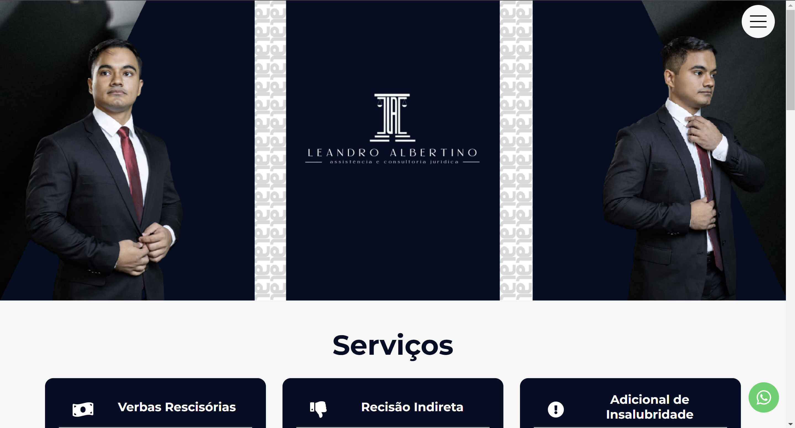
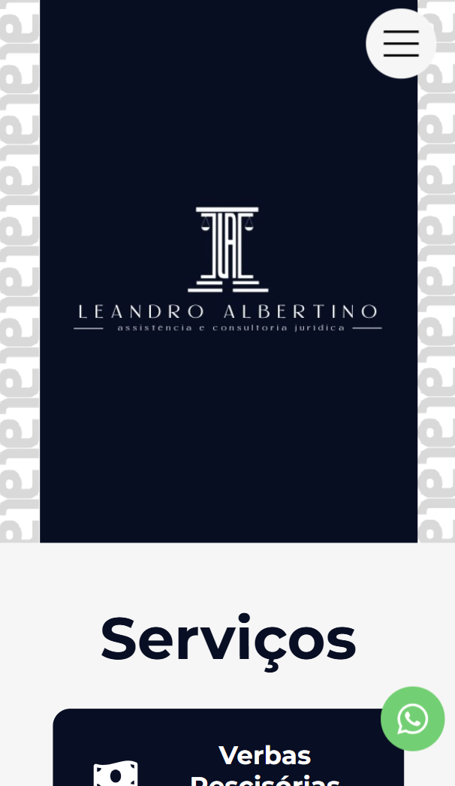

# Assistência e Consultoria Jurídica - Leandro Albertino

Landing Page de advocacia exibindo demandas atendidas, contando um pouco sobre o profissional e com opções para entrar em contato, com responsividade e estilização conforme o cliente escolhe.

## Visão Geral

### Screenshot

#### Versão desktop

#### Versão mobile

### Link

- Página do GitHub : [landing-page-advocacia-leandro-albertino](https://github.com/Shyayhs/landing-page-advocacia-leandro-albertino)
- Página do GitHub Pages: [Assistência e Consultoria Jurídica - Leandro Albertino](https://shyayhs.github.io/landing-page-advocacia-leandro-albertino/)

## Autor

- Linkedin - [Pedro Lucas](www.linkedin.com/in/pedro-lucas-rocha)
- Frontend Mentor - [@Shyayhs](https://www.frontendmentor.io/profile/Shyayhs)
- Github - [@Shyayhs](https://github.com/Shyayhs)
